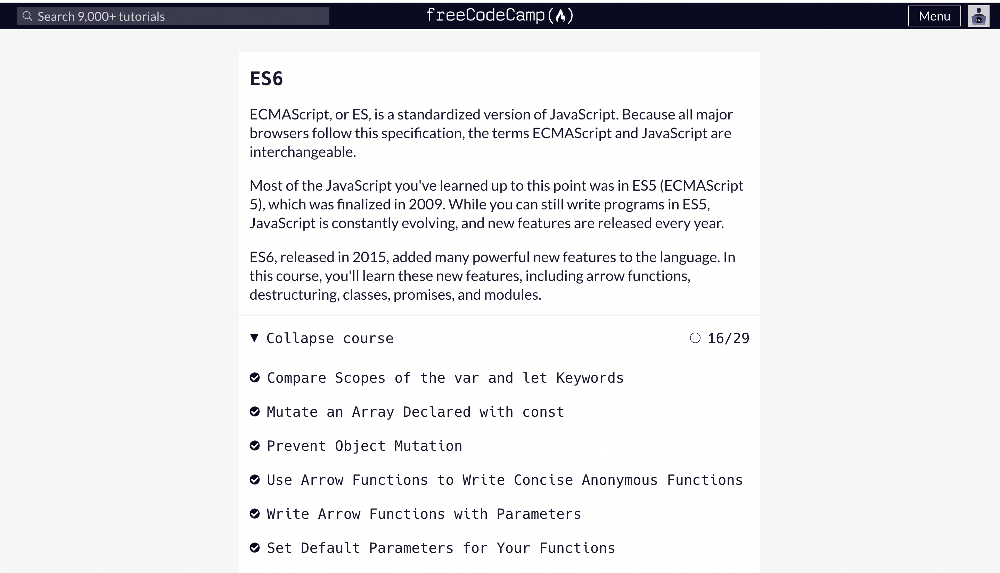

# kottans-frontend

---

# General

---

## 0. Git Basics
I'm very excited about learning this course. I think I understand almost everything about git now. Thank you so much for giving such interesting information. I hope I'll be strong enough to finish the whole Stage 0 ;)
---
## 1. Linux CLI, and HTTP

+ It was very useful information for me. I've already known basic Linux commands, but it's always good to repeat things you already know, isn't it?;)
+ Also, I didn't know anything neither about HTTP nor about HTTPS so I got a lot of new and very useful information for myself from this lesson.
---
## 2. Git Collaboration

I learned a lot about the Git version control system.
The assignments weren't very difficult because I've encountered git before and I already know the basics, but there was also a lot that was new. Some of the tasks really got me thinking
Overall, I found this assignment to be very useful and this knowledge will definitely help me in the future.
By the way, I passed all the tasks a few days ago but forgot to take a screenshot of the result, and when I went to the site today it turned out that all the progress was reset and I had to go through everything all over again, so the optional tasks are not completed.

---

# Front-End Basics

---

## 3. Intro to HTML & CSS

I've worked as an HTML and CSS programmer for a year so I didn't know anything new from these tasks. But I really liked the way they're giving information, I think this course is beneficial for people who're just starting to learn HTML and CSS

---

## 4. Responsive Web Design

As I've said in the previous task, I know HTML and CSS very very well and I didn't know anything new from this task. But I really liked "Grid garden" and "Froggy" games. I think it's a very good way for new students to learn HTML and CSS.

---

## 5. HTML & CSS Practice

Done

---

## 6. JavaScript Basics

I've learned a lot of new information about js during these tasks. This was very interesting to learn. And I think this information will be beneficial for me in the future when I'll be doing real projects.
In conclusion, I can say that it was very hard, but I'm happy that I've solved this challenge.

---

## 7. Document Object Model

[Demo](https://celentanoo0.github.io/DOM-Kottans/)

It was an exciting task. I've known a lot new about manipulation with DOM. Also, I've used many methods of js that I've learned in the previous tasks. So I really liked this practice.

---

# Advanced Topics

---

## 8. A Tiny JS World

[Demo](https://celentanoo0.github.io/a-tiny-JS-world/)
[Code](https://github.com/Celentanoo0/a-tiny-JS-world)

I've known a lot new about classes in JS, it was very difficult, but I understand that it's very important and it will be useful in the future

## 9. Object oriented JS
## 10. OOP exercise
## 12. Memory pair game
## 14. Friends App