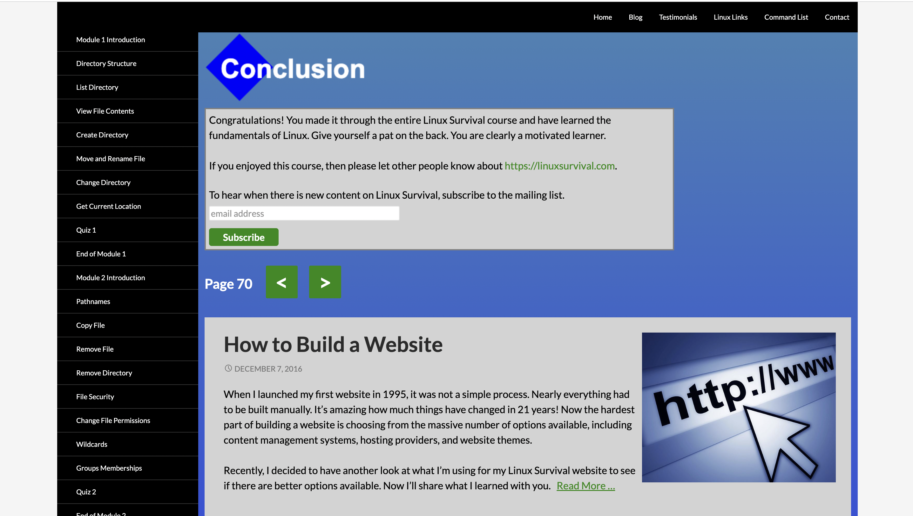

# kottans-frontend

---

# General

---

## 0. Git Basics
I'm very excited about learning this course. I think I understand almost everything about git now. Thank you so much for giving such interesting information. I hope I'll be strong enough to finish the whole Stage 0 ;)
---
## 1. Linux CLI, and HTTP

+ It was very useful information for me. I've already known basic Linux commands, but it's always good to repeat things you already know, isn't it?;)
+ Also, I didn't know anything neither about HTTP nor about HTTPS so I got a lot of new and very useful information for myself from this lesson.
---
## 2. Git Collaboration

I learned a lot about the Git version control system.
The assignments weren't very difficult because I've encountered git before and I already know the basics, but there was also a lot that was new. Some of the tasks really got me thinking
Overall, I found this assignment to be very useful and this knowledge will definitely help me in the future.
By the way, I passed all the tasks a few days ago but forgot to take a screenshot of the result, and when I went to the site today it turned out that all the progress was reset and I had to go through everything all over again, so the optional tasks are not completed.

---

# Front-End Basics

---

## 3. Intro to HTML & CSS
## 4. Responsive Web Design
## 5. HTML & CSS Practice
## 6. JavaScript Basics
## 7. Document Object Model

---

# Advanced Topics

---

## 8. A Tiny JS World
## 9. Object oriented JS
## 10. OOP exercise
## 12. Memory pair game
## 14. Friends App